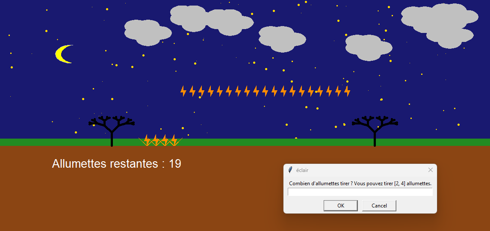

#  Smart Nim AI Strategy

<div align="center">

[](https://www.python.org/)
[]()

[🇺🇸 English Version](#-english-version) | [🇫🇷 Version Française](#-version-française)

</div>

---

## 🇺🇸 English Version

### Overview
An algorithmic implementation of the **Nim Game** (Jeu des Allumettes) featuring an unbeatable Artificial Intelligence.
The project demonstrates the application of **Game Theory** (Marienbad variant) visualized through a dynamic graphical interface.

### Key Features
* **Perfect Information AI:** The algorithm calculates the "Winning Strategy" at every turn (Modulo arithmetic).
* **Visual Rendering:** Dynamic matchstick generation using the Python Turtle library.
* **Game State Management:** Robust loop handling player turns, AI calculation, and win conditions.
* **Dynamic Gameplay:** Randomized matchsticks number and matchsticks withdrawal possibilites.


---

## 🇫🇷 Version Française

###  Présentation
Une implémentation algorithmique du **Jeu de Nim** (Jeu des Allumettes) intégrant une Intelligence Artificielle imbattable.
Le projet démontre l'application de la **Théorie des Jeux** (variante Marienbad) visualisée via une interface graphique dynamique.

###  Fonctionnalités Clés
* **IA à Information Parfaite :** L'algorithme calcule la "Stratégie Gagnante" à chaque tour (Arithmétique modulaire).
* **Rendu Visuel :** Génération dynamique des allumettes via la librairie Python Turtle.
* **Gestion d'État :** Boucle de jeu robuste gérant les tours joueurs, les calculs de l'IA et les conditions de victoire.
* **Nouvelle disposition de jeu :** Le nombre d'allumettes et le nombre d'allumettes à tirer est randomisé.

---

### Installation

```bash
git clone [https://github.com/TonPseudo/Nim-Game-AI-Engine.git](https://github.com/OthmaneBahri/Strategic-Matchstick-Engine.git)
python JeuAllumOrdiGagnant.py
